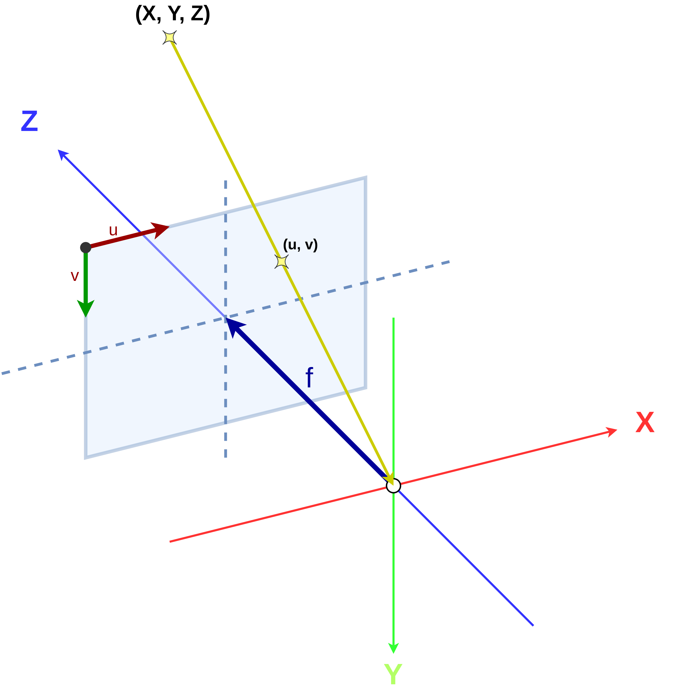
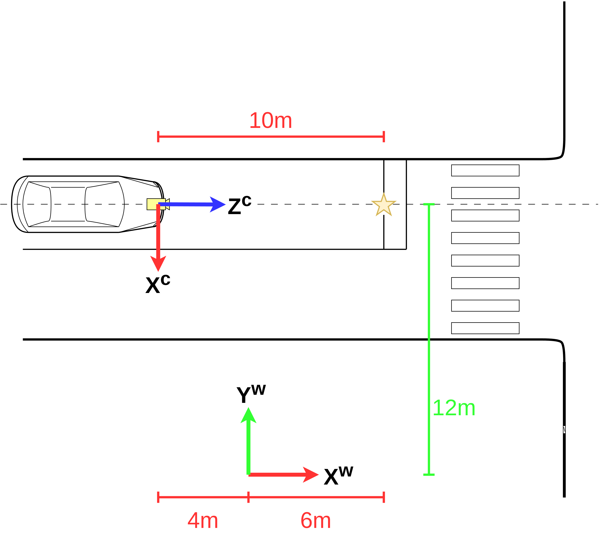
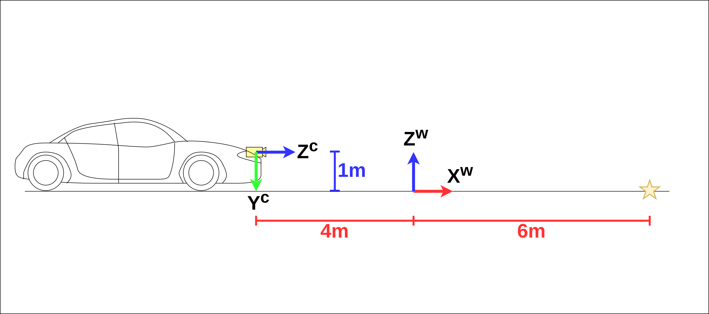

ワールド座標系とカメラ座標系
============================

**著者** 石田 岳志 `サイバーエージェント AI Lab <https://research.cyberagent.ai/>`__

みなさんはスマートフォンで風景やお菓子の写真を撮るとき、写りがよくなるように撮影位置を変えたり、設定をいじったりしますよね。このとき、みなさんはカメラの世界で物事を考えています。「横から撮ったほうがケーキがおいしそうに見えるかも」「もうすこし明るく撮れば紅葉がもっときれいに写るかも」。こんなふうに考えながら写真を撮っているときは、誰もが画面に写る景色に夢中になっているでしょう。では、カメラを使っていないときはどうでしょうか。赤く染まる紅葉が湖面に反射するのを眺めているとき、ケーキを口に運んで甘さにうっとりしているとき、みなさんは現実世界のことに夢中です。

カメラは現実世界を写す道具です。湖の向こうから流れてくる空気の冷たさや、ケーキのスポンジのやわらかさこそ伝えられないものの、現実世界の光を画像というかたちで記録することができます。今回の内容は、現実世界とカメラの関係を、数式で明らかにしてみようというお話です。

カメラの世界と現実の世界
------------------------

:ref:`pinhole_camera_model` のページではピンホールカメラモデルについて解説し、3次元空間の物体とその像の関係を記述する数式を紹介しました。

   ピンホールカメラモデル

ピンホールカメラモデルは、「カメラから見て :math:`(X, Y, Z)` の位置にある物体を写すと写真の :math:`(u, v)` の位置に写るよ」というふうに3次元空間上の物体の座標とその像の位置の関係を説明するものでした。これで3次元空間の物体とその像の関係を簡潔に記述できるようになり、とても便利になったのですが、現実世界の問題を扱うためにはもう少しやらなければならないことがあります。それが本稿で解説する、ワールド座標系での物体位置の表現とカメラ座標系への変換方法です。この変換をマスターすると、たとえば自動運転において道路周辺の物体を高速に認識できるようになるなど、さまざまな製品の品質向上に役立てることができます。

自動運転の車によってスーパーに行きたいとします。スーパーに行くには、地図上のスーパーの位置と、地図上での自分の位置がわかっていなければなりません。スーパーの位置はあらかじめ地図に記録されていますが、自動車のように常に位置が変化する物体を地図に埋め込むことはできないので、自動車の位置は常に推定し続ける必要があります。自動車の位置を推定する方法にはGPSを使う方法やLiDARと呼ばれるセンサを使う方法などさまざまなものがありますが、今回はカメラの話なので車載カメラで位置推定することを考えます。自動車のフロントガラスにカメラを埋め込んで、周囲の状況を把握して車の位置を推定するとしましょう。このとき必要になるのがワールド座標系とカメラ座標系という概念です。

一般的に、地図は適当な場所を原点として、北や東など方角にあった向きに描かれます。一方で、ピンホールカメラモデルによって像の位置を計算するときは、周囲の物体はカメラの位置や向きを基準として表現されます( :numref:`2d_3d_relationship_pinhole_camera_2` )。位置推定や3次元復元の問題において、地図の座標系は一般的に地図座標系や **ワールド座標系** と呼ばれ、カメラの座標系は **カメラ座標系** と呼ばれます。横断歩道や標識などの物体の位置を表現するには、地図の原点を基準にしたワールド座標系と、カメラを基準にしたカメラ座標系という2つの方法があるというわけです。

   ワールド座標系とカメラ座標系それぞれによる停止線の位置の表現。停止線の位置を星で表現し、その値をカメラ座標系とワールド座標系でそれぞれ表現している。

   :numref:`vehicle_location_on_road` を横から見たもの。カメラの高さは地面から1メートルとする。

具体例を見てみましょう。 :numref:`vehicle_location_on_road` と :numref:`vehicle_side_view` を見てください。ワールド座標系とカメラ座標系を区別しやすいように、ワールド座標系の軸には右肩に :math:`w` を、カメラ座標系の軸には右肩に :math:`c` をつけています。ワールド座標系の位置や向きは基本的に地図の作成者が好きなように決めることができます。図中では停止線の位置を星マークで表現したので、これをワールド座標系とカメラ座標系でそれぞれ表現してみましょう。

:numref:`vehicle_location_on_road` において、停止線の位置をワールド座標系で表現すると、 :math:`X^{w}` 方向に6メートル、:math:`Y^{w}` 方向に12メートルです。また、 :numref:`vehicle_side_view` より、停止線の位置は :math:`Z^{w}` 方向に0メートルです。すべて列挙すると、 :math:`X^{w} = 6,\;Y^{w} = 12,\; Z^{w} = 0` というふうになるでしょう。同様に、 カメラ座標系で停止線の位置を表現すると、 :numref:`vehicle_location_on_road` より :math:`X^{c}` 方向に0メートル、 :numref:`vehicle_side_view` より :math:`Y^{c}` 方向に1メートル、 :math:`Z^{c}` 方向に10メートルなので、 :math:`X^{c} = 0,\; Y^{c} = 1,\; Z^{c} = 10` となります。停止線という同じ物体を見ていても、基準となる座標系が変わることで全く別の値になることがわかっていただけたでしょうか。見やすいよう、これらを :numref:`stop_line_location` にまとめました。

.. table:: 各座標系からの停止線の位置
   :name: stop_line_location

   ==============  ============
   座標系          停止線の位置
   ==============  ============
   ワールド座標系  (6, 12, 0)
   カメラ座標系    (0, 1, 10)
   ==============  ============

座標変換
--------

:ref:`pinhole_camera_model` のページで解説したように、ピンホールカメラモデルは、カメラ座標系を基準として物体を見たときに、それが画像上のどの位置に映るのかを表すモデルです。したがって、ピンホールカメラモデルにはカメラ座標系で表現される物体の場所、すなわち :math:`(X^{c}, Y^{c}, Z^{c})` を入力する必要があります。一方で、地図上の物体の位置はワールド座標系の値 :math:`(X^{w}, Y^{w}, Z^{w})` で表現されています。先ほど示した自動車の位置推定などの問題では、「ワールド座標系で表現されている物体の座標をカメラに投影すると、画像中のどこに写るのか」という計算を非常に頻繁に行います。しかし、ワールド座標系で表現されている座標をピンホールカメラモデルにそのまま入力することはできません。ここで必要になるのがワールド座標系からカメラ座標系への座標変換です。ワールド座標系上の座標の値は「地図の世界の言葉」で書かれている一方で、カメラ座標系上の座標の値は「カメラの世界の言葉」で書かれています。ピンホールカメラモデルは地図の世界の言葉を理解できないので、これをカメラの世界の言葉に翻訳する必要があるのです。

座標変換を使うと、実世界のさまざまな課題を解決することができます。たとえば、自動運転車には周囲の標識や信号機を認識するための高性能なカメラが搭載されています。これらのカメラは非常に高画質なので、画像のサイズも大きくなります。自動運転によって安全な走行を実現するためには、車両のはるか遠くにある標識や信号機も早い段階で見つける必要があります。しかし、高性能カメラが撮影した大きな画像の中から、車両のはるか遠くの小さな物体を見つけるのは簡単ではありません。もし「画像のこのあたりに標識が写っているはずだ」という見当をつけられれば、標識や信号機の認識処理を効率化できますよね。これから説明する座標変換を使うと、標識や信号機が画像のどこに写るのかを正確に計算できるので、物体認識の処理を効率化できます。このように、座標変換をマスターすると、自動運転車をはじめとして世の中の多くの製品やサービスの品質向上に貢献できます。

一般に、3次元空間上である物体の座標を2つの異なる座標系で表現できているとき、この間の変換は回転行列と並進ベクトルで記述できることが知られています。

:math:`R^{cw}` を3次元の回転行列、 :math:`\mathbf{t}^{cw}` を3次元の並進ベクトルとすると、ワールド座標系上の座標 :math:`\mathbf{p}^{w} = \left[X^{w} \quad Y^{w} \quad Z^{w}\right]^{\top}` からカメラ座標系上の座標  :math:`\mathbf{p}^{c} = \left[X^{c} \quad Y^{c} \quad Z^{c}\right]^{\top}` までの変換は次のようになります。

.. math::
   :label: coordinate_transform

   \mathbf{p}^{c}
   =
   R^{cw}\mathbf{p}^{w}
   +
   \mathbf{t}^{cw}

この式による :math:`\mathbf{p}^{w}` から :math:`\mathbf{p}^{c}` への変換が「翻訳」に相当します。

すこし分かりづらいと思うので、具体例を見てみましょう。

:numref:`vehicle_side_view` および :numref:`vehicle_location_on_road` の例では、ワールド座標系から見た停止線の位置は

.. math::
   \mathbf{p}^{w}
   =
   \begin{bmatrix}
     X^{w} \\ Y^{w} \\ Z^{w}
   \end{bmatrix}
   =
   \begin{bmatrix}
     6 \\ 12 \\ 0
   \end{bmatrix}

カメラ座標系から見た停止線の位置は

.. math::
   \mathbf{p}^{c}
   =
   \begin{bmatrix}
     X^{c} \\ Y^{c} \\ Z^{c}
   \end{bmatrix}
   =
   \begin{bmatrix}
     0 \\ 1 \\ 10
   \end{bmatrix}

でした。

実際に :eq:`coordinate_transform` によってワールド座標系の停止線の位置 :math:`\mathbf{p}^{w}` をカメラ座標系から見た値 :math:`\mathbf{p}^{c}` に変換してみましょう。

:math:`R^{cw}` と :math:`\mathbf{t}^{cw}` を次のように設定すると、ワールド座標系からカメラ座標系への変換を行うことができます。なぜこのような値になるのかはあとで説明するので、まずは変換を実際にやってみましょう。

.. math::
   R^{cw} &=
   \begin{bmatrix}
     0 & -1 & 0 \\
     0 & 0 & -1 \\
     1 & 0 & 0 \\
   \end{bmatrix} \\
   \mathbf{t}^{cw} &=
   \begin{bmatrix}
     12 \\
     1  \\
     4  \\
   \end{bmatrix}

:eq:`coordinate_transform` に当てはめてみます。

.. math::
   :label: coordinate_transform_with_actual_values

   R^{cw}\mathbf{p}^{w}
   +
   \mathbf{t}^{cw}
   &=
   \begin{bmatrix}
     0 & -1 & 0 \\
     0 & 0 & -1 \\
     1 & 0 & 0 \\
   \end{bmatrix}
   \begin{bmatrix}
     6 \\ 12 \\ 0
   \end{bmatrix}
   +
   \begin{bmatrix}
     12 \\
     1  \\
     4  \\
   \end{bmatrix} \\
   &=
   \begin{bmatrix}
     0 \\
     1  \\
     10  \\
   \end{bmatrix} \\
   &=
   \mathbf{p}^{c}

となり、実際に変換を行うことができました。

回転行列であることの確認
~~~~~~~~~~~~~~~~~~~~~~~~

ところで :math:`R^{cw}` は回転行列でなければならないので、回転行列の定義である :math:`{R^{cw}}^{\top} = {R^{cw}}^{-1}` および :math:`\det{R^{cw}} = 1` を満たさなければなりません。

:math:`{R^{cw}}^{\top} = {R^{cw}}^{-1}` であることを確かめるには :math:`{R^{cw}}^{\top}R^{cw}` が単位行列であることを示せればよいので、実際に計算してみましょう。

.. math::
   {R^{cw}}^{\top}R^{cw} &=
   \begin{bmatrix}
     0 & 0 & 1 \\
     -1 & 0 & 0 \\
     0 & -1 & 0 \\
   \end{bmatrix}
   \begin{bmatrix}
     0 & -1 & 0 \\
     0 & 0 & -1 \\
     1 & 0 & 0 \\
   \end{bmatrix} \\
   &=
   \begin{bmatrix}
     1 & 0 & 0 \\
     0 & 1 & 0 \\
     0 & 0 & 1 \\
   \end{bmatrix} \\

また、 :math:`\det{R^{cw}} = 1` についてもサラスの公式により容易に確かめられます。

導出方法
~~~~~~~~

さて、回転行列と並進ベクトルによってワールド座標系からカメラ座標系への変換を記述できることを確認できたので、ここからは回転行列と並進ベクトルの導出手順を見ていきます。とはいってもたいしたことはせず、それぞれの座標系の中心から停止線までの位置関係を比較していくだけなので、それほど難しくありません。

:numref:`vehicle_location_on_road` を見てください。
カメラ座標系の :math:`Z^{c}` 軸とワールド座標系の :math:`X^{w}` 軸は同じ向きを向いていますね。また、カメラ座標系の原点から見ると、ワールド座標系の原点の位置は :math:`Z^{c}` 軸方向に4メートル進んだ場所にあることがわかります。

したがって、

.. math::
   :label: zc_xw_relationship

   Z^{c} = X^{w} + 4

が成り立ちます。

他の2つの軸についても見ていきましょう。

:math:`X^{c}` 軸はどうでしょう。:math:`X^{c}` 軸に対して :math:`Y^{w}` 軸は逆を向いています。また、カメラ座標系の原点から見てワールド座標系の原点の位置は :math:`X^{c}` 軸方向に12メートル進んだ場所にあります。したがって、両者の関係は

.. math::
    X^{c} = -Y^{w} + 12

となります。

最後に :math:`Y^{c}` 軸も見てみましょう。 :numref:`vehicle_side_view` において、:math:`Y^{c}` 軸に対して :math:`Z^{w}` 軸は逆を向いています。また、カメラ座標系の原点から見てワールド座標系の原点の位置は :math:`Y^{c}` 軸方向に1メートル進んだ場所にあります。したがって、両者の関係は

.. math::
   Y^{c} = -Z^{w} + 1

と記述できます。

3つの式を並べると次のようになります。

.. math::
   X^{c} &= -Y^{w} + 12  \\
   Y^{c} &= -Z^{w} + 1   \\
   Z^{c} &= X^{w}  + 4   \\

これこそがカメラ座標系とワールド座標系の関係です。これを行列で表現すれば、 :eq:`coordinate_transform_with_actual_values` の回転行列や並進ベクトルが得られます。

.. math::
   :label: coordinate_transform_with_actual_values_non_homogeneous

   \begin{bmatrix}
     X^{c}  \\ Y^{c} \\ Z^{c}
   \end{bmatrix}
   &=
   \begin{bmatrix}
     0 & -1 & 0 \\
     0 & 0 & -1 \\
     1 & 0 & 0 \\
   \end{bmatrix}
   \begin{bmatrix}
     X^{w}  \\ Y^{w} \\ Z^{w}
   \end{bmatrix}
   +
   \begin{bmatrix}
    12  \\
    1   \\
    4   \\
   \end{bmatrix} \\

ワールド座標系とカメラ座標系という異なる2つの座標系を回転行列と並進ベクトルが関連付けているということがおわかりいただけたでしょうか？

同次座標による表現
~~~~~~~~~~~~~~~~~~

同次座標表現という表現方法を用いると :eq:`coordinate_transform` をより簡潔に書くことができるのでここで紹介しておきます。といっても、ベクトルの末尾に1をくっつけると計算が簡潔になるというだけの話なのでとてもかんたんです。

例としてベクトル :math:`\mathbf{p}^{w} = \begin{bmatrix} X^{w} & Y^{w} & Z^{w} \end{bmatrix}^{\top}` の同次座標表現を示します。 :math:`\mathbf{p}^{w}` の同次座標表現を :math:`\dot{\mathbf{p}^{w}}` とすると、これは次のようになっています。

.. math::
   \dot{\mathbf{p}^{w}}
   =
   \begin{bmatrix}
    \mathbf{p}^{w} \\ 1
   \end{bmatrix}
   =
   \begin{bmatrix}
    X^{w} \\ Y^{w} \\ Z^{w} \\ 1
   \end{bmatrix}

単純に末尾に1がついただけですね。

同次座標表現を使うと :eq:`coordinate_transform` をより単純な1本の式で表現できます。

.. math::
   \mathbf{p}^{c}
   &=
   R^{cw}\mathbf{p}^{w}
   +
   \mathbf{t}^{cw} \\
   &=
   \begin{bmatrix}
   \begin{array}{ccc|c}
      &        & &                 \\
      & R^{cw} & & \mathbf{t}^{cw} \\
      &        & &                 \\
   \end{array}
   \end{bmatrix}
   \begin{bmatrix}
     \mathbf{p}^{w} \\ \\ 1
   \end{bmatrix}

具体例として :eq:`coordinate_transform_with_actual_values_non_homogeneous` を同次座標表現すると次のようになります。

.. math::
   \begin{bmatrix}
    X^{c}  \\
    Y^{c}  \\
    Z^{c}  \\
   \end{bmatrix}
   &=
   \begin{bmatrix}
     0 & -1 & 0 & 12  \\
     0 &  0 & -1 & 1   \\
     1 &  0 &  0 & 4  \\
   \end{bmatrix}
   \begin{bmatrix}
    X^{w}  \\
    Y^{w}  \\
    Z^{w}  \\
    1      \\
   \end{bmatrix}

たしかに、 :math:`X^{w},\;Y^{w},\;Z^{w}` にワールド座標系の座標値を入力すれば、たった1回の行列演算でカメラ座標系の値に変換できて便利ですね。

.. math::
   \begin{bmatrix}
    X^{c}  \\
    Y^{c}  \\
    Z^{c}  \\
   \end{bmatrix}
   &=
   \begin{bmatrix}
     0 & -1 & 0 & 12  \\
     0 &  0 & -1 & 1   \\
     1 &  0 &  0 & 4  \\
   \end{bmatrix}
   \begin{bmatrix}
    6   \\
    12  \\
    0   \\
    1   \\
   \end{bmatrix} \\
   &= \begin{bmatrix}
   0 \\ 1 \\ 10
   \end{bmatrix}

なお、入力側(ワールド座標系側)だけでなく、出力側(カメラ座標側)も同次座標表現することが可能です。この場合、変換行列のサイズが :math:`4 \times 4` になります。

.. math::
   \begin{bmatrix}
    X^{c}  \\
    Y^{c}  \\
    Z^{c}  \\
    1
   \end{bmatrix}
   &=
   \begin{bmatrix}
     0 & -1 & 0 & 12  \\
     0 &  0 & -1 & 1  \\
     1 &  0 &  0 & 4  \\
     0 & 0 & 0 & 1 \\
   \end{bmatrix}
   \begin{bmatrix}
    X^{w}  \\
    Y^{w}  \\
    Z^{w}  \\
    1
   \end{bmatrix}

ピンホールカメラモデルとの組み合わせ
------------------------------------

ここまで、ワールド座標系で表現された物体の座標をカメラ座標系での値に変換する方法を見てきました。物体の位置がワールド座標系で表現されていたとしても、上記の方法でカメラ座標系の値に変換すれば、ピンホールカメラモデルに入力することができます。ワールド座標系からカメラ座標系への変換パラメータ(回転行列と並進ベクトル)と、カメラの内部パラメータさえわかっていれば、ワールド座標形状の物体をカメラで撮影したときの像の位置を得ることができます。すなわち、「地図上で○○の場所にある物体を××の場所にあるカメラで撮影すると画像上の△△のところに写るよ」ということを計算で示せるわけです。:numref:`vehicle_location_on_road` と :numref:`vehicle_side_view` を例として実際にやってみましょう。ただしカメラパラメータは :numref:`camera_parameters_for_stop_line_projection` の値を用いることとします。

.. table:: 計算に用いるカメラパラメータ
   :name: camera_parameters_for_stop_line_projection

   ===============   ===========
   パラメータ        数値
   ===============   ===========
   X方向焦点距離     500ピクセル
   Y方向焦点距離     500ピクセル
   X方向オフセット   180ピクセル
   Y方向オフセット   120ピクセル
   ===============   ===========

:numref:`vehicle_location_on_road` と :numref:`vehicle_side_view` において、ワールド座標系における停止線の位置は

.. math::
   \mathbf{p}^{w}
   =
   \begin{bmatrix}
     X^{w} \\ Y^{w} \\ Z^{w}
   \end{bmatrix}
   =
   \begin{bmatrix}
     6 \\ 12 \\ 0
   \end{bmatrix}

でした。これをカメラ座標系から見た値に変換すると、

.. math::
   :label: stop_line_coordinate_transform

   \mathbf{p}^{c}
   &=
   \begin{bmatrix}
    X^{c}  \\
    Y^{c}  \\
    Z^{c}  \\
   \end{bmatrix} \\
   &=
   \begin{bmatrix}
     0 & -1 & 0 & 12  \\
     0 &  0 & -1 & 1   \\
     1 &  0 &  0 & 4  \\
   \end{bmatrix}
   \begin{bmatrix}
    X^{w}  \\
    Y^{w}  \\
    Z^{w}  \\
    1      \\
   \end{bmatrix} \\
   &=
   \begin{bmatrix}
     0 & -1 & 0 & 12  \\
     0 &  0 & -1 & 1   \\
     1 &  0 &  0 & 4  \\
   \end{bmatrix}
   \begin{bmatrix}
    6      \\
    12     \\
    0      \\
    1      \\
   \end{bmatrix}  \\
   &=
   \begin{bmatrix}
     0 \\ 1 \\ 10
   \end{bmatrix}

となるのでした。

ピンホールカメラモデルを使って停止線をカメラに投影してみます。
:numref:`camera_parameters_for_stop_line_projection` より、カメラの内部行列 :math:`K` は次のようになります。

.. math::
   K =
   \begin{bmatrix}
   500 &   0 & 180  \\
     0 & 500 & 120  \\
     0 &   0 &   1  \\
   \end{bmatrix}

.. math::
   Z \begin{bmatrix} u \\ v \\ 1 \end{bmatrix}
   &= K\mathbf{p}^{c} \\
   &=
   \begin{bmatrix}
   500 &   0 & 180  \\
     0 & 500 & 120  \\
     0 &   0 &   1  \\
   \end{bmatrix}
   \begin{bmatrix}
     0 \\ 1 \\ 10
   \end{bmatrix}

一番下の行を計算すると、 :math:`Z = 10` であることがわかります。これを代入して計算を進めていきます。

.. math::
   :label: stop_line_projection

   \begin{bmatrix} u \\ v \\ 1 \end{bmatrix}
   &=
   \frac{1}{Z}
   \begin{bmatrix}
   500 &   0 & 180  \\
     0 & 500 & 120  \\
     0 &   0 &   1  \\
   \end{bmatrix}
   \begin{bmatrix}
     0 \\ 1 \\ 10
   \end{bmatrix} \\
   &=
   \frac{1}{10}
   \begin{bmatrix}
   500 &   0 & 180  \\
     0 & 500 & 120  \\
     0 &   0 &   1  \\
   \end{bmatrix}
   \begin{bmatrix}
     0 \\ 1 \\ 10
   \end{bmatrix} \\
   &= \begin{bmatrix}
   180 \\
   170 \\
   1
   \end{bmatrix}

計算の結果、 :math:`(u,\; v) = (180,\; 170)` が得られました。

ワールド座標系で :math:`(X^{w},\;Y^{w},\;Z^{w}) = (6,\;12,\;0)` にある停止線は、画像の左上を基準として右に180ピクセル、下に170ピクセル数えたところに写ることがわかりました。

これらの計算はひとつにまとめることができます。:eq:`stop_line_coordinate_transform` によるワールド座標系からカメラ座標系への変換と、 :eq:`stop_line_projection` によるカメラ座標系上の座標からカメラへの投影を組み合わせると次のようになります。

.. math::

   \begin{bmatrix} u \\ v \\ 1 \end{bmatrix}
   &=
   \frac{1}{Z} \;
   K
   \begin{bmatrix}
   \begin{array}{ccc|c}
      &        & &                 \\
      & R^{cw} & & \mathbf{t}^{cw} \\
      &        & &                 \\
   \end{array}
   \end{bmatrix}
   \begin{bmatrix}
     \mathbf{p}^{w} \\ \\ 1
   \end{bmatrix}  \\
   &=
   \frac{1}{10}
   \begin{bmatrix}
   500 &   0 & 180  \\
     0 & 500 & 120  \\
     0 &   0 &   1  \\
   \end{bmatrix}
   \begin{bmatrix}
     0 & -1 & 0 & 12  \\
     0 &  0 & -1 & 1   \\
     1 &  0 &  0 & 4  \\
   \end{bmatrix}
   \begin{bmatrix}
    6      \\
    12     \\
    0      \\
    1      \\
   \end{bmatrix}  \\
   &= \begin{bmatrix}
   180 \\
   170 \\
   1
   \end{bmatrix}

まとめ
------

ピンホールカメラモデルでは「カメラを基準とした世界」しか扱えませんでしたが、ワールド座標系を導入することで「地図を基準とした世界」も扱えるようになりました。また、ワールド座標系からカメラ座標系への変換方法を知ることにより、地図上の物体をカメラで扱うことができるようになりました。身の回りには掃除ロボットや配膳ロボットをはじめとして、地図とカメラをセットで扱う製品がすでに普及してきています。こういった製品は小型で、安く、長時間動作することが求められるので、その中で行っている物体認識や位置推定などのさまざまな計算を効率化する必要があります。同次座標のような効率のよい表現方法を知っておくと、こういった計算を少しだけ速くしたり、コードをシンプルに書いたりすることができ、より高品質な製品を生み出す助けとなります。位置推定や3次元復元の分野ではここで紹介した座標変換を非常に頻繁に用いるので、みなさんもぜひたくさん計算して、マスターしてみてください。
