.. _pinhole_camera_model:

ピンホールカメラモデル
======================

**著者** 石田 岳志 `サイバーエージェント AI Lab <https://research.cyberagent.ai/>`__

コンピュータビジョンと3次元復元
-------------------------------

洞窟壁画に始まり、人類は絵画というかたちで3次元空間の物体を石や紙といった2次元の平面上に表現する行為を何千年、何万年と行ってきました。
今でこそスマートフォンを起動してボタンを押せばかんたんに写真が撮れますが、ここに至るまでに長い歴史の道のりをたどってきました。

現在のカメラの原型となった道具は、こんにちにおいてカメラオブスキュラと呼ばれています。これは暗い部屋などの一点に穴を開けておき、そこを通った光が壁や板に映し出す像を観察するというもので、太陽黒点の観測や絵を描くときの補助器具として使われていました。ちなみに、カメラオブスキュラ (camera obscura) はラテン語で「暗い箱」を意味する言葉なので、我々が普段使っているカメラ (camera) はラテン語の「箱」に相当します。本稿で解説するピンホールカメラモデルも、動作のうえではカメラオブスキュラと全く同じものです。16世紀になり、カメラオブスキュラにレンズを取り付けると像が鮮明に写ることが発見されるのですが、その後もカメラオブスキュラはあくまで像を映し出すための道具として存続し、主に絵を描くときの補助器具として使われ続けました。18世紀になると塩化銀が光によって黒ずむ、つまり感光することが明らかになります。これをカメラオブスキュラに取り付けることで「カメラ」や「写真」が生まれ、普及していきました。

現在では半導体素子によって光を検知するデジタルカメラが非常に広く普及したため、もはや感光板や塩化銀フィルムがなくても写真を撮ることができます。人類が写真技術を手に入れ、現実の映像を平面上に再現できるようになると、ただ物体を映すだけでなく、それを解析して理解する技術の発展が始まりました。デジタル技術の進化によってコンピュータで写真を手軽に扱えるようになったことや、コンピュータそのものの処理性能が飛躍的に向上したことで、家庭のパソコンでも非常に複雑な画像処理を実現できるようになってきています。

サイバーエージェント AI Lab において、私はコンピュータビジョン技術の中でもとくに3次元復元を利用した研究開発を行っています。
3次元復元は画像から地図を作る技術であり、すでに家庭用パソコンでもオープンソースのソフトウェアを利用して :numref:`colmap_ezohub` のような高精細な地図を作ることが可能になっています。

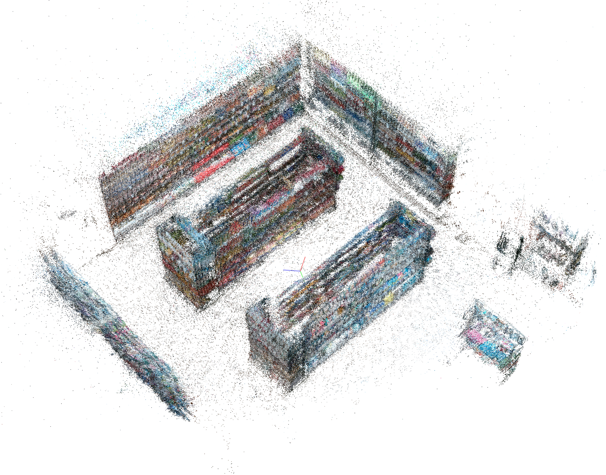

   画像からの3次元復元によって得られた地図

現在のコンピュータビジョン技術は、単なる記録としての写真を超え、写真から3次元の構造を復元し、空間構造を認識することを可能にしています。こういった技術を実現するためには、コンピュータの中でカメラカメラの機能やふるまいを正確に表現する必要があります。今回はピンホールカメラモデルと呼ばれる、コンピュータ上でカメラの動作を表現するための基礎技術を紹介します。

カメラモデルとは
----------------

ピンホールカメラモデルの解説をする前に、カメラモデルについてかんたんに説明します。

コンピュータで画像から :numref:`colmap_ezohub` のような3次元地図を得るためには、3次元空間にある物体とその像の関係を明確に記述する必要があります。カメラが見ている3次元の物体が写真のどこに写っているのか、逆に、写真に写っている物体は3次元空間上のどこに存在するのか、この関係がわからなければ、当然ながら3次元復元などできないのです。ここで必要になるのがカメラモデルです。カメラモデルとは、コンピュータにおいて空間中の3次元物体とカメラに写った像の関係を記述するための数理モデルです。数理モデルというとなんとなく難しそうに聞こえますが、今回ご紹介するピンホールカメラモデルは非常にシンプルで、最終的には掛け算や足し算で表せる2本の式が出てくるだけですので、そう難しくはありません。行列を使うと2本の式を同じ意味の1本の式に落とし込むことができるので、本稿ではそこまで解説します。

ピンホールカメラモデル
----------------------

カメラには大きく2つの要素があります。ひとつはレンズで、もうひとつはフィルム(デジタルカメラでは撮像素子)です。物体からカメラに向かってきた光は、レンズを通ってフィルムに当たります。このため、近くにあるものは大きく、遠くにあるものは小さく写ります。また、像は実際の物体の向きとは反対の向きにフィルムに写ります。これを表したのが :numref:`lens_camera_close` と :numref:`lens_camera_far` です。 :numref:`lens_camera_close` は物体が近くにある場合、 :numref:`lens_camera_far` は物体が遠くにある場合の様子を示しています。

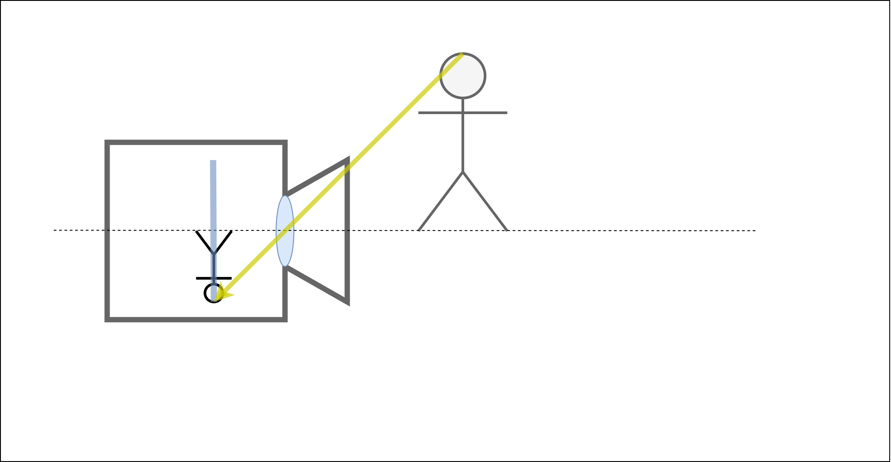

   近くのものは大きく写る

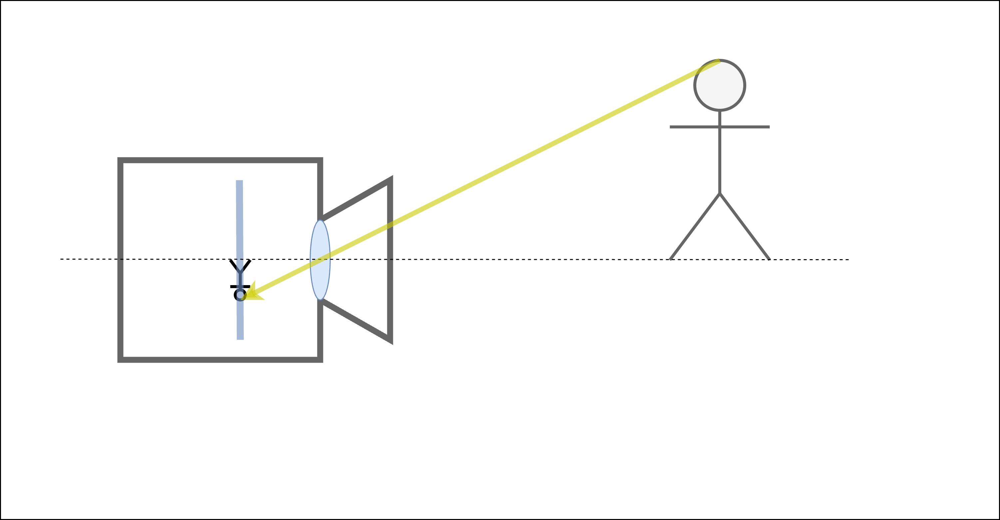

   遠くのものは小さく写る

さて、ここでレンズを取り払い、小さな穴に置き換えるとどうなるでしょう。物体からきた光は穴を通り、やはりフィルムに写ります。

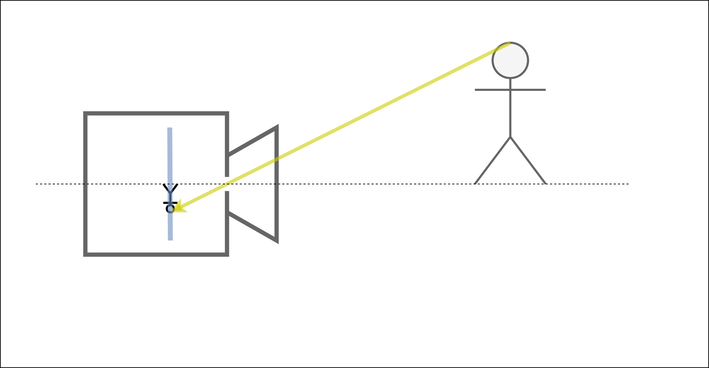

   レンズを小さな穴に置き換えても、近くのものは大きく写る

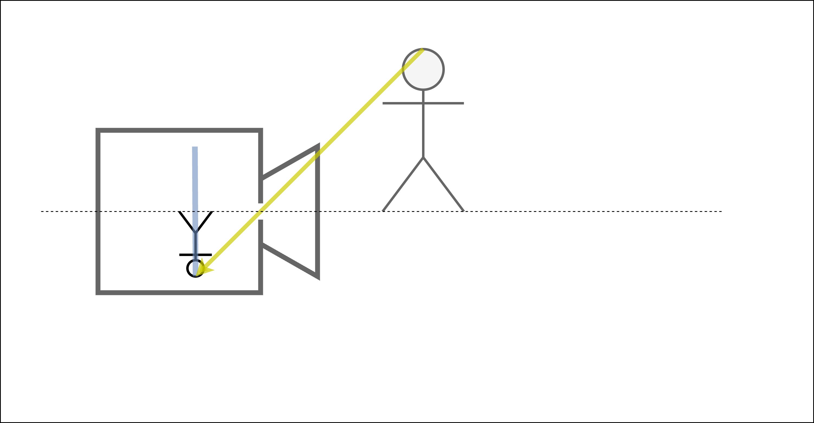

   レンズを小さな穴に置き換えても、遠くのものは小さく写る

ここで重要なのは、レンズを小さな穴に置き換えても、近くのものは大きく写り、遠くのものは小さく写るという基本的な性質が変わらないことです( :numref:`pinhole_camera_close` 、 :numref:`pinhole_camera_far` )。

レンズを小さな穴に置き換えてしまって、本当にカメラとして機能するのかと疑問に思う方もいらっしゃると思いますが、実際にこれはカメラとして機能し、像もちゃんと写ります。このように小さな穴を通して像を写すカメラはピンホールカメラと呼ばれており、実際に厚紙やお茶の缶などを使ってかんたんに自作できます。冒頭で紹介したカメラオブスキュラも、これと全く同じ原理のものでした。

レンズ付きのカメラであろうと、ピンホールカメラであろうと、近くのものは大きく写り、遠くのものは小さく写るという基本的な性質は変わりません。であれば、ピンホールカメラの方が構造もかんたんで、いろいろな議論を楽に進めることができます。デジタルカメラやスマホのカメラにはレンズが埋め込まれているので、構造がピンホールカメラとは異なりますが、レンズによって像を写すカメラのふるまいも多くの場合ピンホールカメラモデルで記述できることが知られています。

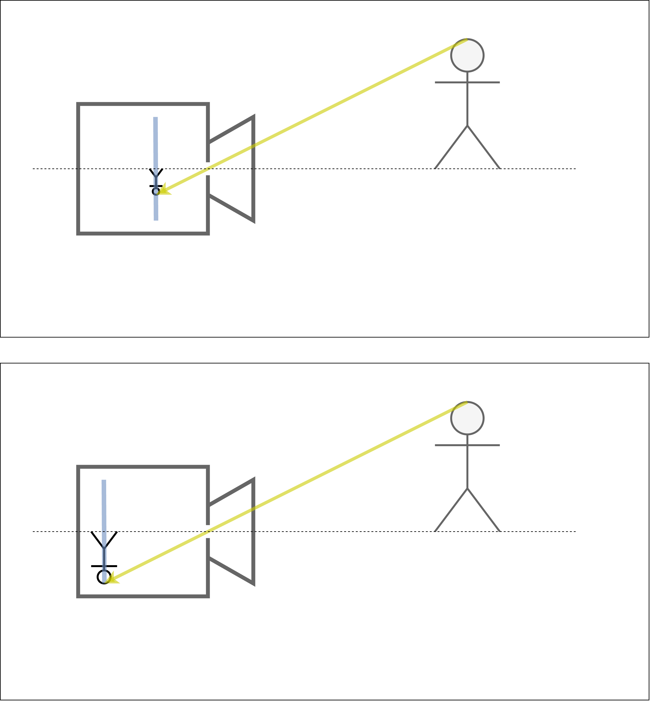

   フィルムが穴の近くにあると、像は小さく写る。フィルムが穴の遠くにあると、像が大きく写る。

ここからはピンホールカメラの形を少しずつ変えてみて、像がどのように変化するのか見てみましょう。ピンホールカメラを自作したことがある人は、フィルム(あるいは像が写るスクリーン)を穴に近づけたり、遠ざけたりしてみたことがあるかもしれません。 :numref:`pinhole_camera_screen_position` に示したように、フィルムを穴に近づけると像は小さくなりますし、フィルムを穴から遠ざけると像は大きくなります。

数式で表現してみる
~~~~~~~~~~~~~~~~~~

この性質を数式で表現してみましょう。

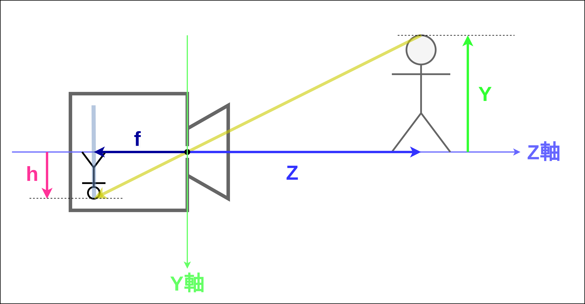

   フィルムまでの距離とフィルムに写る像の大きさの関係

:numref:`projection_relationship` に、物体の位置、カメラとフィルムの距離、像の大きさの関係を示しました。なぜZ軸がカメラの正面方向に、Y軸が下向きになっているのか疑問に思うかもしれませんが、その理由はあとで説明するのでいまは気にしなくて大丈夫です。
カメラの穴を基準とした物体のZ軸方向の位置を :math:`Z` 、フィルムの位置を :math:`f` とします。また、Y軸に沿った物体の位置を :math:`Y` 、像の位置を :math:`h` とします。このとき、 :numref:`projection_relationship` より :math:`h / f = Y / Z` が成り立つことがおわかりいただけるでしょうか？したがって、像の大きさ :math:`h` は

.. math::
   :label: image_focal_length_relationship_y

   h = f \frac{Y}{Z}

と表すことができます。
この式を見ると、物体の大きさ :math:`Y` とカメラから物体までの距離 :math:`Z` が変化しないとき、すなわち静止したカメラで静止した物体を撮っているとき、像の大きさ :math:`h` はカメラの穴からフィルムまでの距離 :math:`f` に比例することがわかっていただけると思います。カメラの穴からフィルムまでの距離 :math:`f` は像の大きさについて論ずる際に非常に重要なパラメータであり、一般に **焦点距離** と呼ばれます。また、ピンホールカメラモデルにおいて、カメラの穴の部分は像として写るすべての光が通過する場所であり、この点を基準としてさまざまな計算を行うときれいに式を書くことができます。こういった理由から、ピンホールカメラモデルの穴の部分は計算の基準点という意味で **カメラ中心** と呼ばれます。

:eq:`image_focal_length_relationship_y` ではY軸方向(カメラの縦方向)に沿って像の大きさを記述しましたが、同様の議論はX軸方向(カメラの横方向)についても成り立つはずです。

:math:`X` 方向に沿った像の位置を :math:`g` とすると、これは

.. math::
   :label: image_focal_length_relationship_x

   g = f \frac{X}{Z}

と表現できます。X軸とY軸の両方について像の大きさを記述したものを :numref:`projection_xy_screen_back_human` に示しました。

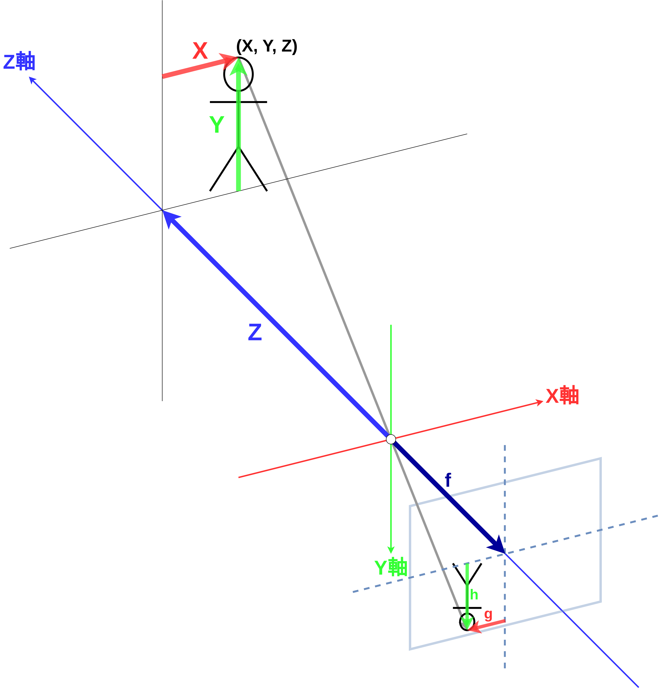

   X軸とY軸の両方についての投影を表した図

像が反転する問題を解消する
~~~~~~~~~~~~~~~~~~~~~~~~~~

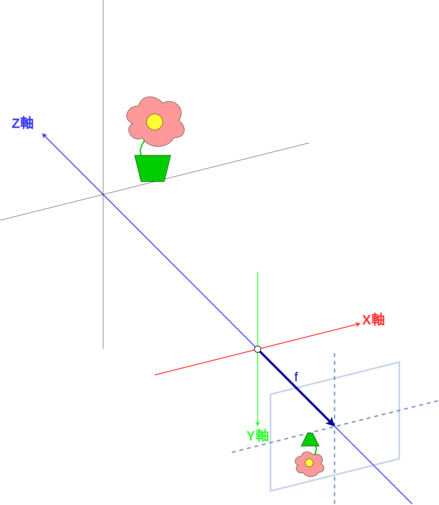

   いままでの方式だと像が反転してしまう

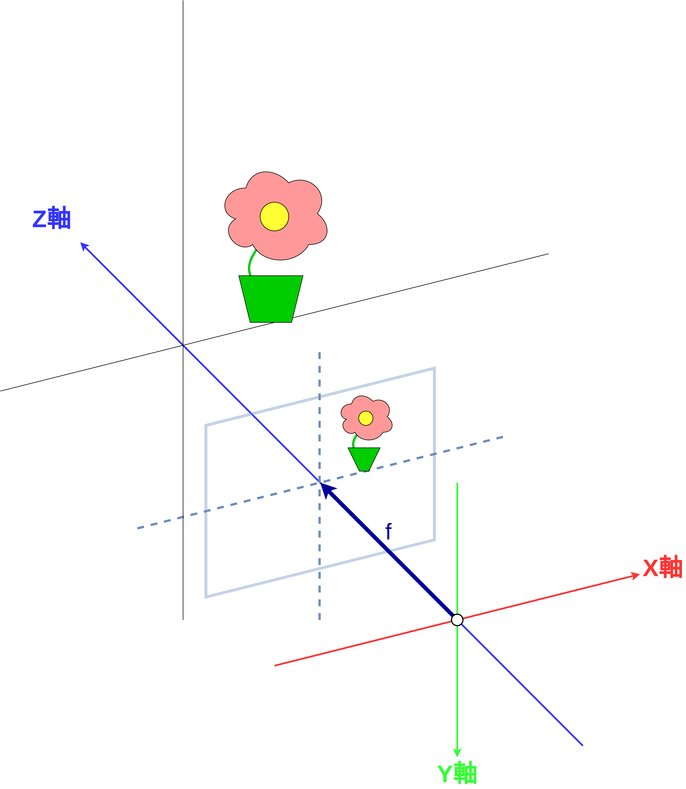

   像が写るスクリーンを手前に持ってくると、像が反転しない

さて、 :numref:`projection_xy_screen_back_flower` を見るとわかるように、 現状の方法では像の向きが物体の向きに対して反転してしまうという問題がありました。そこで実際のカメラの構造上はありえないことですが、像を写すスクリーンが穴の前にあると考えて同様の計算を進めます。すると、物体から穴までの光の通り道を変えなくても、像が反転せずにスクリーンに写ります(:numref:`projection_xy_screen_front_flower`)。計算してみるとすぐにわかるのですが、スクリーンを前に持ってきても、3次元物体の位置と像の大きさの関係の式になんら変化は起きません(:numref:`projection_xy_screen_front_human`)。いままでどおり、 :math:`g = f \frac{X}{Z},\; h = f \frac{Y}{Z}` という式で像の大きさを記述することができます。

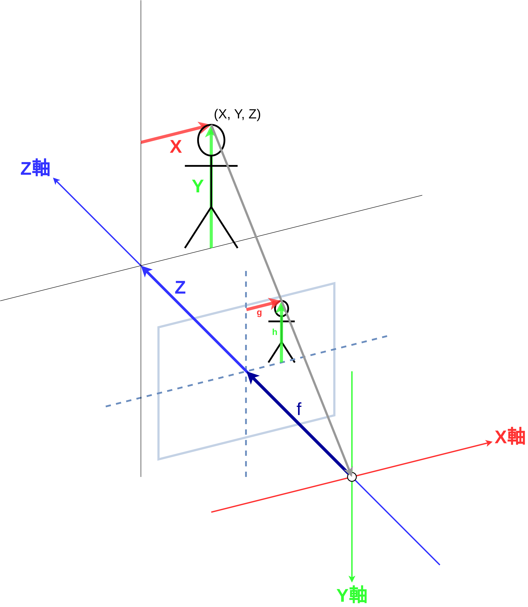

   スクリーンを前に持ってきても、 :math:`g = f \frac{X}{Z},\; h = f \frac{Y}{Z}` が成り立つ。

画像座標での表現
~~~~~~~~~~~~~~~~

.. math::
   :label: image_focal_length_relationship

   g &= f \frac{X}{Z} \\
   h &= f \frac{Y}{Z} \\

これまでの議論により、物体の像の座標を :eq:`image_focal_length_relationship` で表現できるようになりました。このままでも十分ピンホールカメラの機構を十分に表現できているのですが、実用上はもう少しだけやることがあります。

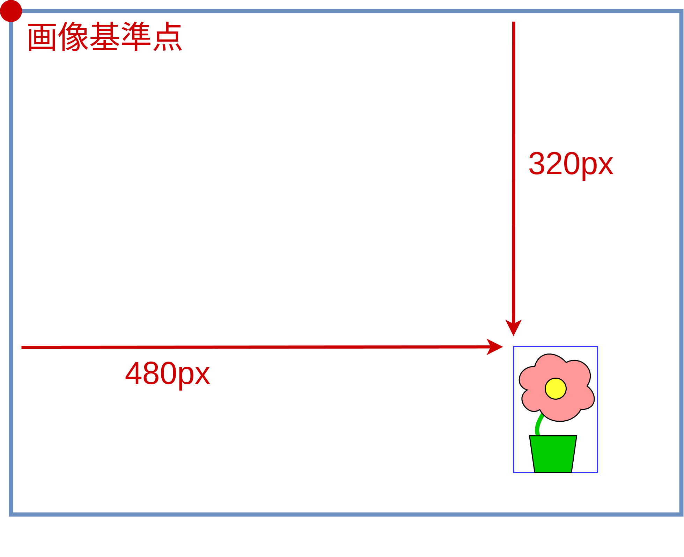

   画像中の物体の座標

.. figure:: ../assets/2d_3d_relationship_pinhole_camera.png
   :name: 2d_3d_relationship_pinhole_camera
   :width: 80%

   3次元点とその像の関係

皆さんは画像編集をしたことがあるでしょうか。画像を切り抜き加工するときは :numref:`object_location_in_image` のように、おそらく画像の左上を基準として、左から何ピクセル、上から何ピクセルと数えて切り抜く場所を指定すると思います。コンピュータビジョンの世界でも同じで、画像中の点の位置は左から :math:`u` ピクセル、上から :math:`v` ピクセルと数えて指定します。カメラのY軸が下に向いている理由はまさにこれで、 :numref:`2d_3d_relationship_pinhole_camera` に示したように、X軸とu軸、Y軸とv軸の向きを一致させたいというわけです。

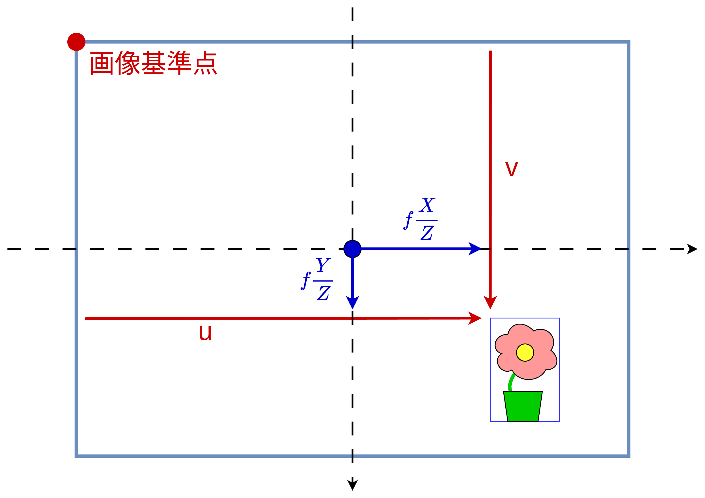

   物体座標を用いた像の位置の表現(青)と画像のピクセルによる表現(赤)

問題はここからです。ピンホールカメラモデルにおいて、フィルムとカメラのZ軸が交差する場所は、多くの場合においてフィルム面の中心付近です。したがって :numref:`image_coordinate_vs_world_coordinate` に示したように、 :eq:`image_focal_length_relationship` で表される像の位置は画像とZ軸の交点を基準としています。一方で、画像中の座標 :math:`(u, v)` は、ともに画像の左上を基準としています。

:math:`fX / Z,\; fY / Z` と :math:`u,\; v` という、別々の場所を基準として記述された量を結びつけるにはどうすればよいでしょうか？

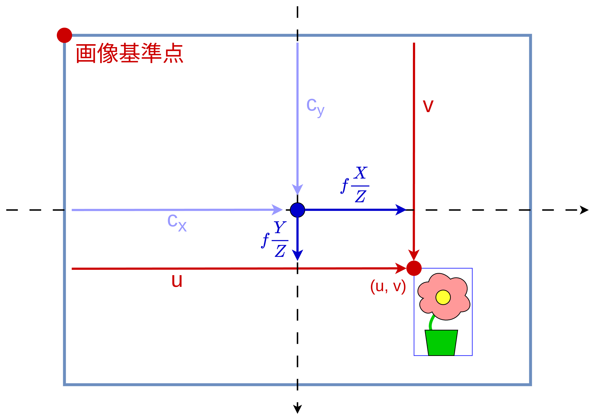

   オフセット :math:`c_{x},\; c_{y}` を導入し、画像中の物体の座標を :math:`(X,\; Y,\; Z)` によって記述できるようにする。

ここで導入されるのが、 :numref:`introduction_of_image_offsets` で示されるオフセット :math:`c_{x},\;c_{y}` です。これは画像の左上(図中の赤丸)を基準とした、画像面とZ軸の交点(図中の青丸)の位置を表しています。オフセット :math:`c_{x},\;c_{y}` を使うことで、 :math:`fX / Z,\; fY / Z` と :math:`u,\; v` という別々の値を関連付けることができます。

.. math::
   :label: pinhole_camera_model_equation

   u &= f \frac{X}{Z} + c_{x} \\
   v &= f \frac{Y}{Z} + c_{y} \\

:eq:`pinhole_camera_model_equation` と :numref:`introduction_of_image_offsets` を見比べてみてください。たしかに成立していることがおわかりいただけると思います。これで無事に3次元点 :math:`(X,\,Y,\,Z)` とその像 :math:`(u,\, v)` を関連付ける数式を導出できました。これがピンホールカメラモデルの基礎となる式です。

画像上の位置の表現
~~~~~~~~~~~~~~~~~~

ピンホールカメラモデルの基本的な式を導出できました。皆さんはすでに、3次元点の座標 :math:`(X,\; Y,\; Z)` とパラメータ :math:`f,\;c_{x},\;c_{y}` さえ与えられれば、3次元点をカメラに投影したときの座標 :math:`(u,\;v)` を :eq:`pinhole_camera_model_equation` を使って計算することができます。

では実用上はどうでしょうか？実世界のデータを扱う際には単位に気をつける必要がありますね。実際に3次元復元を行う際には、3次元点の位置を「メートル」という単位で表したり、像の位置を「ピクセル」という単位で表したりする必要が出てきます。このため、ここからは :eq:`pinhole_camera_model_equation` に対して明確に単位を与える操作を行っていきます。

一眼レフカメラなどを扱ったことがある方なら、「焦点距離」という単語を目にした際にピンときたと思います。そう、レンズの焦点距離です。一眼レフカメラのレンズには :numref:`dslr_camera_50mm_lens` のように焦点距離が記載されています。

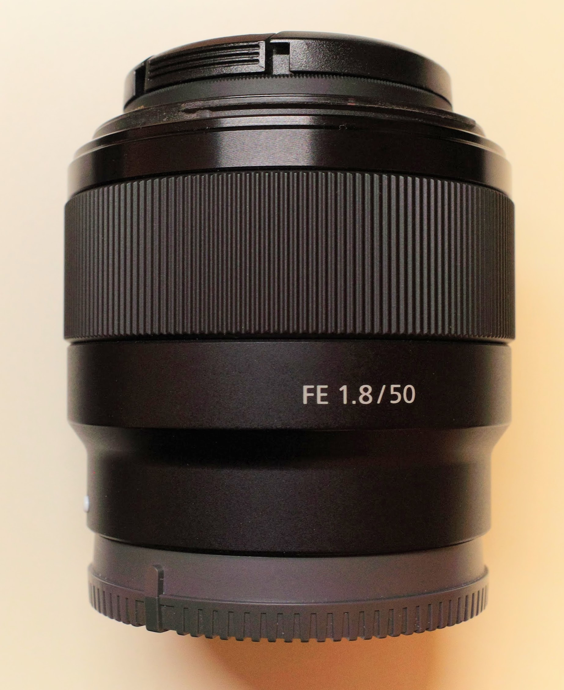

   一眼レフカメラのレンズ。50という数字は焦点距離が50mmであることを示している。

これを踏まえて改めてピンホールカメラモデルの式を見てみましょう。

.. math::
   u &= f \frac{X}{Z} + c_{x} \\
   v &= f \frac{Y}{Z} + c_{y} \\

仮に焦点距離 :math:`f` として50ミリメートルという値を採用するのであれば、オフセット :math:`c_{x},\;c_{y}` もそれに合わせてミリメートルで表記する必要があります。

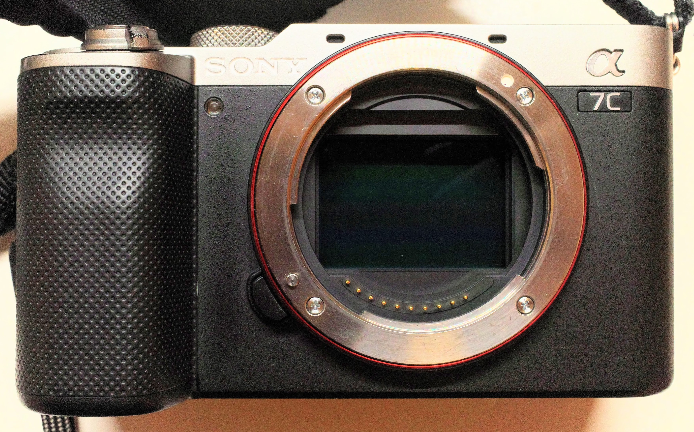

   一眼レフカメラの本体。円の中に見える長方形の部分が撮像素子であり、通常は縦24ミリメートル、横36ミリメートルのサイズで作られている。

:numref:`dslr_camera_body` のように、一眼レフカメラは通常横36ミリメートル、縦24ミリメートルの撮像素子を備えています。 一般的にはカメラはレンズの中心位置が撮像素子の中心にくるように設計されているので、一眼レフカメラのオフセットはX方向に横幅の半分の18ミリメートル、Y方向に縦幅の半分の12ミリメートルと設定されるはずです。

これをピンホールカメラモデルの式に代入してみましょう。

.. math::
   u &= 50 \frac{X}{Z} + 18 \quad &&\text{[mm]} \\
   v &= 50 \frac{Y}{Z} + 12 \quad &&\text{[mm]} \\

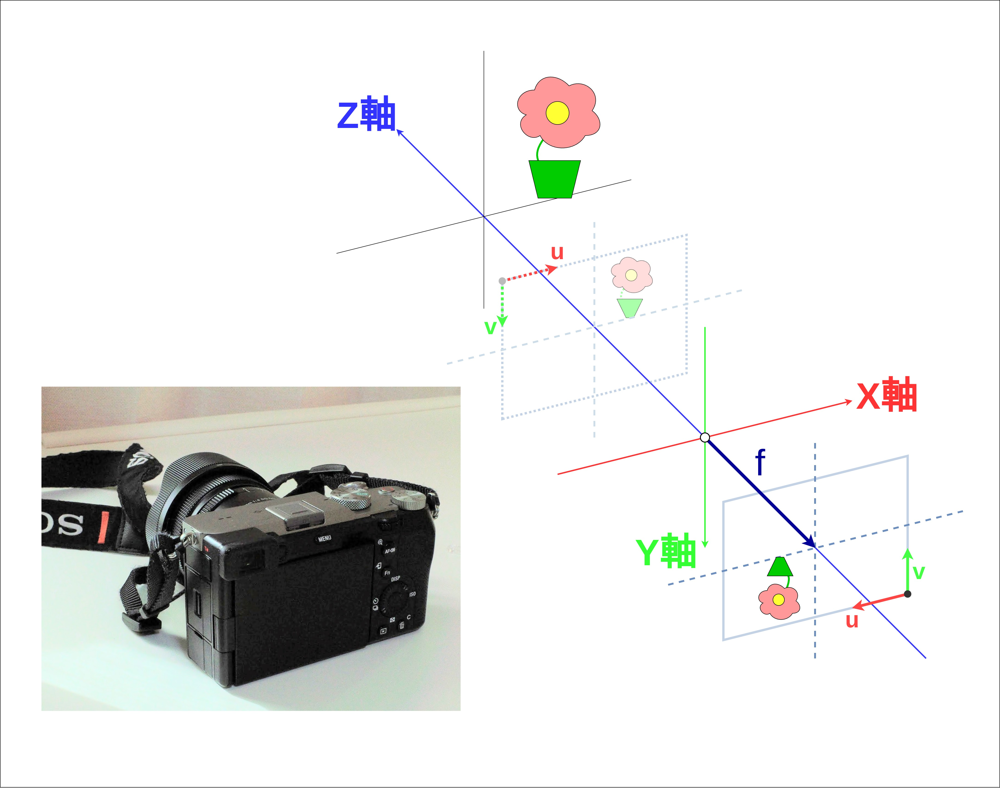

   実際のカメラと座標系の比較。 :math:`u` と :math:`v` という値は、カメラを背後から見たときに、像が撮像素子のどこに写るのかを表す。

右辺と左辺は同じ単位を持っていなければなりません。:math:`X / Z` や  :math:`Y / Z` は同じ単位同士で比をとっているため、式全体の単位には影響を及ぼしません。したがって、右辺の値がミリメートルという単位で表されていることを踏まえると、左辺の :math:`u` や :math:`v` もそれぞれミリメートルで表現されなければならないことがわかります。では、ミリメートルという単位で表現された :math:`u,\;v` という値は、いったい何を表しているでしょうか？これは **撮像素子上の** どこに像が写っているかを表現しています。 :numref:`camera_and_its_coordinate` のようにカメラを背後から見てみましょう。:math:`u` と :math:`v` という値は、撮像素子の左上を基準として、右方向に :math:`u` ミリメートル、下方向に :math:`v` ミリメートルのところに像が写ることを表すのです(ただし実際には像は反転して写るので、撮像素子の右下を基準として左に :math:`u` ミリメートル、上に :math:`v` ミリメートルのところに写ります)。焦点距離もオフセットもカメラのレンズや撮像素子というハードウェアの値をそのまま使っているので、:math:`u` と :math:`v` も撮像素子というハードウェアに基づいた値になるわけです。

実際にひとつ例を示します。カメラから見て :math:`(X,\;Y,\;Z) = (20,\;-10,\;100)` メートルの位置にある物体を撮影したとき、その像の位置は次の計算式によって求められます。

.. math::
   u &= 50 \frac{20}{100} + 18 \\
     &= 28 \quad \text{[mm]} \\
   v &= 50 \frac{(-10)}{100} + 12 \\
     &= 7  \quad \text{[mm]} \\

:math:`X,\;Y,\;Z` はいずれもメートルで表現されていますが、 :math:`X` と :math:`Z` 、 :math:`Y` と :math:`Z` で比を計算しているので式全体の単位には影響を及ぼさないのです。

計算結果より、物体の像は撮像素子の右下を基準として左に :math:`u = 28` ミリメートル、上に :math:`v = 7` ミリメートルの位置に投影されます。

撮像素子と画素
~~~~~~~~~~~~~~

さて、先の計算によって、撮像素子上のどこに像が投影されるのかを特定することができました。しかし、実際の利用場面ではそれがどれほど役に立つでしょうか？私たちが本当に知りたいのは、「撮像素子上のどこに物体が写っているか」ではなく、「**画像内の** どこに物体の像が写っているか」ではないでしょうか。
具体的には、撮像素子の左上（または右下）から何ミリメートルの位置に像が写るかを知りたいのではなく、画像の左上から何ピクセルの位置に像が写るかを知りたいのです。上の例では、焦点距離やオフセットの値をミリメートル単位で表現し、撮影素子上の像の位置 :math:`(u,\;v)` を求めました。しかし、実際には画像上の像の位置をピクセルという単位で求める必要があります。

:math:`u` と :math:`v` をピクセルという単位で表現するためには、そもそもピクセルが何なのかをよく理解する必要がありますね。「ピクセル」という単位はカメラの撮像素子の構造に密接に関連しているので、撮像素子について詳しく見ていきましょう。

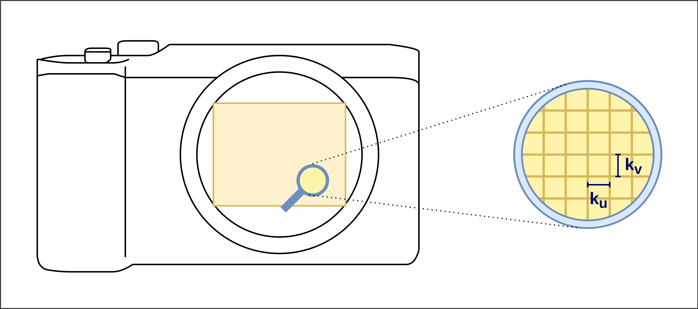

   撮像素子は画素の集合でできている。ここではわかりやすさのために画素のサイズを実際よりもかなり大きく描いている。実際の画素のサイズは数ミクロン四方であり、肉眼で見ることはできない。

:numref:`camera_pixel_closeup` のように、カメラの撮像素子は、「画素」と呼ばれる光をとらえるための箱が何千万個も集まってできています。画素は入ってくる光の強さや色を識別することができ、この情報を画像の1ピクセルとして記録します。

.. figure:: ../assets/waterfall_zoom.png
   :name: waterfall_zoom

   左側は滝の写真であり、数多くのピクセルで構成されている。通常の視点では個々のピクセルは見えず、全体として滑らかに見えるが、右側のように画像を拡大してみると、色のついた四角い点（ピクセル）で構成されていることがわかる。

画素は無限に小さいわけではないので、撮像素子に含まれる画素の数も有限ですし、画像に含まれるピクセルの数も有限です。:numref:`waterfall_zoom` のように画像を拡大すると、画素ひとつ1つが捉えた光を見ることができます。このように、細かい光の単位がたくさん集まって写真になっているわけです。画像上の位置を、たとえば「左上から右に200ピクセル、下に500ピクセル」と表現したとき、これは左上からピクセルを右に200個、下に500個数えた場所を表します。

内部行列のピクセルによる表現
~~~~~~~~~~~~~~~~~~~~~~~~~~~~

我々はすでに、像の位置をミリメートルの単位で表現することができています。

.. math::
   :label: pinhole_camera_model_equation2

   u &= f \frac{X}{Z} + c_{x} \\
   v &= f \frac{Y}{Z} + c_{y} \\

:eq:`pinhole_camera_model_equation2` は、 :math:`(X,\;Y,\;Z)` の位置にある物体を焦点距離 :math:`f` ミリメートル、オフセット :math:`(c_{x},\;c_{y})` のカメラで撮影すると、その像が撮像素子の右下から :math:`u` ミリメートル、上に :math:`v` ミリメートルの位置に写るということを表しているのでした。
像の位置をピクセルで表現するには、撮像素子1ミリメートルあたりに含まれている画素の数をかければいいですよね。 :numref:`camera_pixel_closeup` のように画素ひとつの縦方向のサイズを :math:`k_{u}` ミリメートル、横方向のサイズを  :math:`k_{v}` ミリメートルとすると、撮像素子1ミリメートルあたりの画素の数は縦方向と横方向でそれぞれ :math:`1 / k_{u}` と :math:`1 / k_{v}` で表せます。これを両辺にかければよいので、像の位置は :math:`u` 方向と :math:`v` 方向でそれぞれ次のように表せます。

.. math::
   :label: pinhole_camera_model_divided_by_pixel_size

   \frac{u}{k_{u}} &= \frac{f}{k_{u}}\frac{X}{Z} + \frac{c_{x}}{k_{u}} \\
   \frac{v}{k_{v}} &= \frac{f}{k_{v}}\frac{Y}{Z} + \frac{c_{y}}{k_{v}} \\

この式変形により、 :math:`(X,\;Y,\;Z)` の位置にある物体の像は画像の左上から右に :math:`u / k_{u}` ピクセル、下に :math:`v / k_{v}` ピクセルの位置に写るということがわかりました。

:eq:`pinhole_camera_model_divided_by_pixel_size` は表現としては正確なのですが、このままでは少し読みづらいのでもう少し表記をシンプルにしてみます。

:math:`f / k_{u}` と :math:`f / k_{v}` はそれぞれ :math:`f_{x}` と :math:`f_{y}` で置き換えてしまいましょう。

.. math::
   f_{x} &= \frac{f}{k_{u}} \\
   f_{y} &= \frac{f}{k_{v}} \\

また、像の位置 :math:`u` と :math:`v` をそれぞれ :math:`k_{u}` と :math:`k_{v}` で割ったものを :math:`u` と :math:`v` と思うことにしましょう。:math:`c_{x}` と :math:`c_{y}` についても同様のことを行います。

.. math::
   u &\leftarrow \frac{u}{k_{u}} \\
   v &\leftarrow \frac{v}{k_{v}} \\
   c_{x} &\leftarrow \frac{c_{x}}{k_{u}} \\
   c_{y} &\leftarrow \frac{c_{y}}{k_{v}} \\

以上の操作を行うと、 :eq:`pinhole_camera_model_divided_by_pixel_size` は :eq:`pinhole_camera_model_equation2` とほぼ同じシンプルな形になります。

.. math::
   :label: x_y_individual_focal_length

   u &= f_{x} \frac{X}{Z} + c_{x} \\
   v &= f_{y} \frac{Y}{Z} + c_{y} \\

:eq:`pinhole_camera_model_divided_by_pixel_size` と :eq:`x_y_individual_focal_length` の間で置き換えられた部分を図で表現すると :numref:`pinhole_camera_equation_correspondence` のようになります。

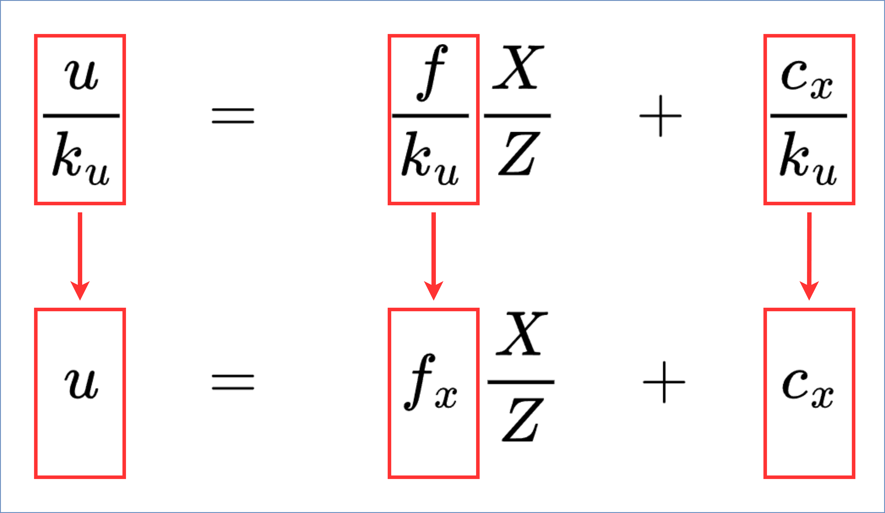

   数式のうち、置き換わった部分

:eq:`x_y_individual_focal_length` に含まれる :math:`u,\;v,\;f_{x},\;f_{y},\;c_{x},\;c_{y}` のいずれもが **ピクセル** という単位で表現されています。:eq:`x_y_individual_focal_length` こそが我々が実用するうえで実際に用いるピンホールカメラモデルの式です。

行列による表現
~~~~~~~~~~~~~~

最後に、ピンホールカメラモデルにおける作法のような表現方法があるので、その式を導出して締めくくることとします。以降の変形によって式をスッキリした形にしておくと、実際の3次元点を使った演算が非常に楽になるのです。

まずは :eq:`x_y_individual_focal_length` をベクトルで表現して、両辺に :math:`Z` をかけます。

.. math::
   Z \begin{bmatrix} u \\ v \\ \end{bmatrix}
   =
   Z
   \begin{bmatrix}
   f_{x} \frac{X}{Z} + c_{x} \\
   f_{y} \frac{Y}{Z} + c_{y} \\
   \end{bmatrix} \\
   =
   \begin{bmatrix}
   f_{x} X + c_{x}Z \\
   f_{y} Y + c_{y}Z \\
   \end{bmatrix} \\

すると、これは次のように行列とベクトルの積で表現できます。

.. math::
   :label: non_homogeneous_camera_matrix

   Z \begin{bmatrix} u \\ v \\ \end{bmatrix}
   =
   \begin{bmatrix}
   f_{x} & 0 & c_{x} \\
   0 & f_{y} & c_{y} \\
   \end{bmatrix}
   \begin{bmatrix}
     X  \\ Y \\ Z
   \end{bmatrix}

おまけに行を1つ追加しておきましょう。

.. math::
   :label: homogeneous_camera_matrix

   Z \begin{bmatrix} u \\ v \\ 1 \end{bmatrix}
   =
   \begin{bmatrix}
   f_{x} & 0     & c_{x} \\
   0     & f_{x} & c_{y} \\
   0     & 0     & 1     \\
   \end{bmatrix}
   \begin{bmatrix}
     X  \\ Y \\ Z
   \end{bmatrix}

:eq:`non_homogeneous_camera_matrix` から :eq:`homogeneous_camera_matrix` の式変形は本当にお作法のようなものなので、深い理由は気にしなくてよいです。
変形後も等式が成立していることだけ確認していただければ十分です。

:eq:`homogeneous_camera_matrix` を見てください。左辺に :math:`Z` が残ってしまっているものの、この式は画像座標 :math:`(u,\;v)` が3次元点のベクトル :math:`\begin{bmatrix} X & Y & Z \end{bmatrix}^{\top}` と3×3行列の積でかんたんに計算できることを示しています。これはまさに、3次元空間上の物体の位置と画像上の像の位置を関連付ける式になっています。

3×3の行列を :math:`K` としましょう。この :math:`K` に含まれる :math:`f_{x},\;f_{y},\;c_{x},\;c_{y}` という4つのパラメータに着目してください。

.. math::
   :label: intrinsic_matrix

   K =
   \begin{bmatrix}
   f_{x} & 0     & c_{x} \\
   0     & f_{y} & c_{y} \\
   0     & 0     & 1     \\
   \end{bmatrix}

被写体が空間上のどこにあっても、カメラをどんな方向に向けても、この4つのパラメータは変化しません。このパラメータが変化するのは、フィルムをピンホールカメラの穴に近づけたときや、フィルムの位置を上下左右にずらしたときなど、カメラの構造に対して物理的に手を加えたときだけです。したがって :math:`f_{x},\;f_{y},\;c_{x},\;c_{y}` という4つのパラメータはカメラ固有のパラメータであり、ピンホールカメラの **内部パラメータ** と呼ばれます。行列 :math:`K` もカメラの内部パラメータのみで構成されているので、 **内部行列** と呼ばれます。

まとめ
------

カメラモデルとは、空間上の物体の座標と画像中の像の座標の関係を記述するための数理モデルです。その中でも特に単純で、かつ一般的に広く用いられているのがピンホールカメラモデルであり、4つの内部パラメータ :math:`f_{x},\;f_{y},\;c_{x},\;c_{y}` で記述されます。ピンホールカメラモデルでは3次元点 :math:`(X,\; Y,\; Z)` とその像の座標 :math:`(u,\;v)` を次の2つの関係式で表現します。

.. math::
   u &= f_{x} \frac{X}{Z} + c_{x} \\
   v &= f_{y} \frac{Y}{Z} + c_{y} \\

これと全く等価な式を行列を使って記述することもでき、3次元空間上の座標 :math:`(X,\;Y,\;Z)` とその像の座標 :math:`(u,\;v)` の関係を簡潔に表すことができます。

.. math::
   Z \begin{bmatrix} u \\ v \\ 1 \end{bmatrix}
   =
   \begin{bmatrix}
   f_{y} & 0     & c_{x} \\
   0     & f_{x} & c_{y} \\
   0     & 0     & 1     \\
   \end{bmatrix}
   \begin{bmatrix}
     X  \\ Y \\ Z
   \end{bmatrix}
